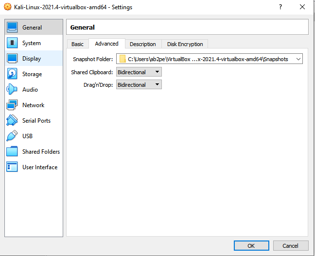

# No WSL After Today !
No Windows System Linux After Today
> This document is talking about how to set a virtual linux system to your windows machine without using WSL.
----

##  Final result


---

The used softwares and apps in this document can be found below:

[Windows Terminal Preview
](https://www.microsoft.com/store/productId/9N8G5RFZ9XK3)

[VirtualBox](https://www.virtualbox.org/wiki/Downloads)

[Kali Linux](https://www.kali.org/get-kali/#kali-virtual-machines)

## Steps of the setting our virual machine in VirtualBox:

After downloading and installing Windows Terminal & VirtualBox, let's extract the `Kali Linux` OVA Image file and import it to our `VirtualBox`, in this step you don't have to make any modification just leave everything as default settings.


After the image was imported without erros, we will change some machine settings by right clicking on the machine and then going to `Settings` and follow the screenshots steps below

1) In the advanced tab let's choose Bidirectional for both of `Shared Clipboard` & `Drag'nDrop`



2) For the system base memory and processor the best recommendation is 2 CPU's and 2 GB of RAM.


3) In the network, choose `NAT` - this is required.


4) Share a folder from your windows to the linux machine, In my case I shared my win desktop and mounted to `/root/Desktop/Windows/`. Don't forget to check `Make Permanent` option.


After that you set everything click OK and Ð congrats! Your machine is ready.

Great ! Now let's run our virtual machine in normal mode ...


Default creds: kali/kali


We need this to check only if our VM is working fine and also to check the network settings.

**Note: Record your IP address - we will need it later.**


Generate a new ssh key for any user, I selected to be root always so by going to terminal and type `sudo su -` then `ssh-keygen` and typing `Enter` few times to generate the key, the process will automatically save our private & public key in `/root/.ssh/id_rsa`


After that let's copy `id_rsa.pub` to `authorized_keys` by typing: `cp id_rsa.pub authorized_keys`

And then copy the private key `cat /root/.ssh/id_rsa`


And paste it in your Windows Desktop Directory


Awesome! Now let's add to our `C:\Windows\System32\drivers\etc\hosts` file this line

```
127.0.0.1 kali.box
```

Let's go back to `VirtualBox` and go to the settings of the Kali machine, and exactly to the network category and click on advanced -


And then port forwarding - 


And follow the steps in this screenshot -


In this rule we added a new value to allow our Windows machine to connect directly to the ssh port of the kali VM.

Now let's go back to the machine, and let's modify the sshd_config file to allow root logins `nano /etc/ssh/ssh_config`


Let's change this line to this

```
PermitRootLogin yes
```

Then let's restart the ssh service and also enabling it in case wasn't enabled by default.


Commands: 

```bash
# To restart SSH
systemctl restart ssh

# To enable SSH
systemctl enable ssh
```

## Steps of setting our Windows Terminal:

Now after that everything is set in our Kali virtual machine ... Let's go to the Windows Terminal and create a new profile


Now follow the steps shown in the screenshot below


The command line:
```
ssh.exe -i id_rsa root@kali.box
```

**Note: `Starting directory` must be where we have our SSH `id_rsa` private key.**

After you set everything as shown click on Save and then go to startup and choose your new profile as the Default profile . Don't forget to click on Save. 


Now if you restart the Windows Terminal, it will run the automatically ssh command and connect you to your Kali VM.


type `yes` and click Enter 


To open the shell directly on our shared Desktop we can add in the end of the file `~/.zshrc` the mounted point (path) we set earlier and in our case:

```bash
cd /root/Desktop/Windows
# or
cd ~/Desktop/Windows
```


---

## Steps to make it run at startup and headless ?

Go to `C:\Users\Username\AppData\Roaming\Microsoft\Windows\Start Menu\Programs\Startup`, change the value Username with your computer username and create a new file let's name it `kali_vbox.bat`

`"C:\Program Files\Oracle\VirtualBox\VBoxManage.exe" startvm "Kali-Linux-2021.4-vbox-amd64" --type headless`

First check if `VBoxManage.exe` is in the right path and the `"Kali-Linux-2021.4-vbox-amd64"` value we can get from the box Name in the settings.


And congratulations! Now the linux vm machine will start in background and you can use everything on your windows desktop as you are working on linux.


--

### Additional Port Forwarding in my own configuration:


The 1st IP is the IP of my THM VPN that I'm connecting to it using my Windows Machine, I use this rule in case I was playing a machine in THM or HTB (must update the IP each time in case you are not using a VIP membership)

The 2nd IP is my lan network address.

---

## Thanking:

In the end I would like to thank `leeloo1313` for helping and encouraging me :D

## Coming:
* An auto setup for the whole process.
* Setting an android emulator on windows and bypassing SSL pinning, and more ...

---

If you liked this content and want to encourage me for more, you can [buymeacoffee](https://www.buymeacoffee.com/ab2pentest).
